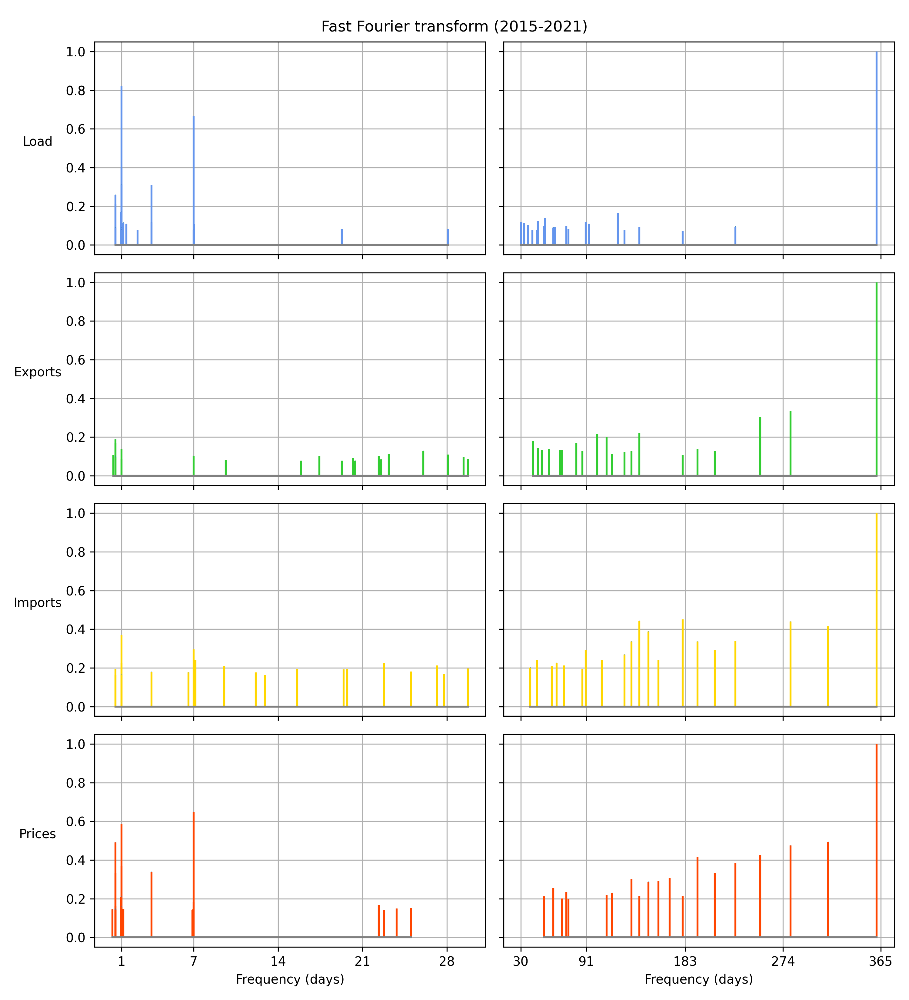
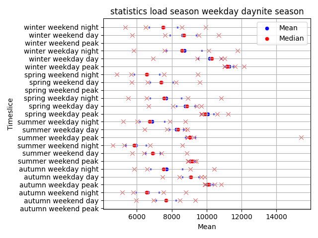

# Preface

*March-June 2022, merlijn*

All of the code used to import, analyse, and visualise the data in the report below can be found in this repository. There are two versions of the code. `v0.1.0` consists of some initial scripts used to create simple load duration graphs. It has limited functionality beyond producing load duration graphs based on the original season and daynite timeslices. This version was produced in April 2022.

`v0.2.0` (May 2022) and `v0.3.0` (June 2022) brought a more fully-fledged suite of scripts with additional features and generalised functions. `v0.2.0` was used in the report below and was released in mid-May 2022. `v0.3.0` added UTC support and included consumer load profiles. The basic structure is as follows:

1. `load.py`: these functions are used to import and clean the data,
2. `assign.py`: this script contains functions that assign the various timeslices to the time series,
3. `analyse.py`: these functions generate visualisations and statistics along with other analysis functions,

All these functions can be run from the `main.py` file or individually in their respective scripts. The idea behind organising the functions and scripts like this is to make it easier to maintain and extend the functions. To this end, most functions are written in a very generalised manner, which should make it easy to add support for additional timeslices, time series, and other improvements. An important factor here is that the functions are (mostly) agnostic to the timeslice or time series used, which means that it is straightforward to add new timeslices (such as the ones mentioned in the discussion) or to use the current functions to analyse new time series. 

A fourth script, `report_visualisations.py`, listed in the `graphs` folder, contains some rough-and-ready code to generate some of the visualisations used in this report. 

I am working on 'translating' some key functions from `python` to `R` (see `r-translation` branch), and on adding more comments to the code to explain its functionality. 

# Documentation

This documentation was written for version `v0.2.0` of the code and updated for `v0.3.0`  with an appendix on consumer load profiles.

## Introduction

TIMES uses timeslices to represent periodic variations in commodities and process input/outputs.  The current version of the TIMES-CZ model uses twelve timeslices: four seasonal timeslices (spring, summer, autumn, winter) and three daynite timeslices (night, day, peak), see tables 1, 2 and 3. Increasing the number of timeslices increases the accuracy of the model, as there are annual variations in the data that have a different frequency than the daily and seasonal variations that are currently captured by the timeslices.

This report builds on Josef's bachelor thesis, where he worked on finding the best method for determining which timeslice load values to use. This work is different in that it purely looks at different types of timeslices and combinations thereof.  Milan and Lukáš suggested some alternative timeslices (see Method). The basic idea is to test different types of timeslices on load, export, import and price data to see which combination of timeslices we can use to enrich the TIMES-CZ model. In order to do this, I wrote a suite of functions that can test different timeslices, in order to determine which combination of timeslices would best enrich the model.

When picking a combination of timeslices, the primary concerns are whether they capture intra/inter-annual variability in the data and thus accurately convey major trends, and the computational and data-gathering cost and of this increased accuracy. Generally speaking, as time resolution increases, the accuracy of the model increases too but so does its computational complexity. Furthermore, it becomes more difficult to gather economic statistics at the same resolution, which reduced the efficacy of the increase timeslice resolution. The data considered in this report (load, consumption, import, export, prices) can be known to a high temporal precision, whereas others (such as production of specific factories, or solar output) can either not be known at such a high temporal resolution or have large year-on-year variability. The goal of this report is to contribute to finding the right trade off between temporal resolution and computational and statistical complexity.

| Code | Season | Length (days) | Description           |
| ---- | ------ | ------------- | --------------------- |
| R    | Spring | 78            | 15 March-31 May       |
| S    | Summer | 91            | 1 June-30 August      |
| F    | Autumn | 77            | 31 August-15 November |
| W    | Winter | 119           | 16 November-14 March  |

_Table 1_: Definition of the seasonal timeslices.

| Code | Daynite | Length (hours) | Description                                          |
| ---- | ------- | -------------- | ---------------------------------------------------- |
| N    | Night   | 12             | all hours between 20:00-08:00.                       |
| D    | Day     | 11             | all hours between 08:00-20:00, except the peak hour. |
| P    | Peak    | 1              | the hour with the highest load during the day.       |

_Table 2_: Definition of the daynite timeslices.

| Season     | Daynite   | TS   | Annual share (%) |
| ---------- | --------- | ---- | ---------------- |
| Spring (R) | Night (N) | RN   | 10.7             |
|            | Day (D)   | RD   | 9.80             |
|            | Peak (P)  | RP   | 0.980            |
| Summer (S) | Night (N) | SN   | 12.5             |
|            | Day (D)   | SD   | 11.4             |
|            | Peak (P)  | PD   | 1.04             |
| Fall (F)   | Night (N) | FN   | 10.5             |
|            | Day (D)   | FD   | 9.67             |
|            | Peak (P)  | FP   | 0.879            |
| Winter (W) | Night (N) | WN   | 16.3             |
|            | Day (D)   | WD   | 14.9             |
|            | Peak (P)  | WP   | 1.36             |

_Table 3_: Annual share of the current timeslices.

## Method

The following data sources were used:

| Data                   | Source                                                         | Scope                              |
| ---------------------- | -------------------------------------------------------------- | ---------------------------------- |
| Load                   | https://www.ceps.cz/en/all-data#Load                           | 2015-2021, hourly average values.  |
| Generation             | https://www.ceps.cz/en/all-data#Generation                     | 2015-2021, hourly average values.  |
| Imports and exports    | https://www.ceps.cz/en/all-data#CrossborderPowerFlows          | 2015-2021, hourly average values.  |
| Prices                 | https://www.ote-cr.cz/en/statistics/yearly-market-report       | 2015-2021, hourly day-ahead price. |
| Consumer load profiles | https://www.ote-cr.cz/en/statistics/electricity-load-profiles/ | 2015-2021, hourly normalised load. |

_Table 4_: Data sources used in this report.

ČEPS is the Czech transmission system operator and OTE-ČR is the Czech electricity and gas market operator. 2015 is the base year of the TIMES-CZ model and 2020 is a milestone year; 2021 is the last year for which full data is available. Hourly (average) values were the highest available temporal resolution available. All of the original data files can be found in the data folder on the GitHub repository. 

The data providers use different time and date definitions, see table 5. The ČEPS data gives the hour and date in CET/CETS (local time), whereas OTE-ČR gives the local date and counts the hour of the day. For both data files, the data was converted to UTC which was then converted to the Czech timezone (CET/CETS).

| Data provider | Data files                     | Date time format | Hours: normal day | Hours: winter time to summer time | Hours: summer time to winter time |
| ------------- | ------------------------------ | ---------------- | ----------------- | --------------------------------- | --------------------------------- |
| ČEPS          | load, generation, cross border | 31.12.2015 00:00 | 0-23              | 0-1, 3-23                         | 0-2, 2-23                         |
| OTE-ČR        | prices, consumer load profiles | 31-12-2015, 1    | 1-24              | 1-23                              | 1-25                              |

_Table 5_: Date time conventions of both data providers. 

Some minor cleaning and reshaping actions were performed on the data (see `load.py`). This included calculating total generation, total import, total export, and net export. The consumer load profile data needed more extensive editing, please see the appendix for more information. The data sources were combined into a single data file, `combined 2015-2021.csv`, which can also be found in the data folder on the GitHub repository (see preface).

The load, import, export and price data were then categorised into the two original time slices (season daynite) and six new timeslices:

1. Month: the month of the date (January, February, ..., December),
2. Weekday 1: whether the date was a working day (generally, Monday-Friday) or a weekend or public holiday (generally, Saturday-Sunday),
3. Weekday 2: the day of the week (Monday, Tuesday, etc),
4. Extended daynite 1: one night time slices, three day time slices. See table 6 for the chosen cut-off times.
5. Extended daynite 2: two night time slices, six day time slices. See table 7 for the chosen cut-off times.
6. Hour: hourly timeslices (00:00, 01:00, ..., 23:00).

As discussed in the preface, the functions that perform these are agnostic as to what time series they are categorising which means that other variables can be categorised in the same way, and that functions with new timeslices can easily be added. 

| Extended daynite 1 | Description |
| ------------------ | ----------- |
| Night              | 20:00-05:00 |
| Morning            | 06:00-09:00 |
| Afternoon          | 10:00-15:00 |
| Evening            | 16:00-19:00 |

_Table 6_: Definition of the extended daynite 1 timeslices.

| Extended daynite 2 | Description |
| ------------------ | ----------- |
| Night-1            | 20:00-01:00 |
| Night-2            | 02:00-07:00 |
| Day-1              | 08:00-09:00 |
| Day-2              | 10:00-11:00 |
| Day-3              | 12:00-13:00 |
| Day-4              | 14:00-15:00 |
| Day-5              | 16:00-17:00 |
| Day-5              | 18:00-19:00 |

_Table 7_: Definition of the extended daynite 2 timeslices.

| Code | Weekday     | Length | Description                                             |
| ---- | ----------- | ------ | ------------------------------------------------------- |
| L    | Working day | 68.7%  | Any working day (most weeks: Monday to Friday).         |
| H    | Weekend day | 31.3%  | Weekend days (Saturday and Sunday) and public holidays. |

_Table 8_: Definition of the weekday timeslices. The length of the timeslices, expressed as an annual percentage, is calculated over 2015-2021 but can vary year-to-year due to differences of the date of public holidays. Note that the length of the working day/weekend day slices is not exactly 5/7 and 2/7 (71.4% and 28.6%), respectively, due to the inclusion of public holidays as weekend days. 

These timeslices were then combined to into groups, based on my judgement of which combinations would produce interesting and usable results. This was broadly done by including at least one long-term timeslice (season, month) and at least one short-term timeslice (daynite, hour, etc). Not all groups were analysed extensively due to time constraints.

| Name | Group                                   | Size             |
| ---- | --------------------------------------- | -----------------|
| Null | Season - daynite                        |  12 (4 × 3)      |
| A    | Season - extended daynite 1             |  16 (4 × 4)      |
| B    | Season - extended daynite 2             |  24 (4 × 8)      |
| C    | Season - hour                           |  96 (4 × 24)     |
| D    | Season - weekday 1 - daynite            |  24 (4 × 2 × 3)  |
| E    | Season - weekday 1 - extended daynite 1 |  32 (4 × 2 × 4)  |
| F    | Season - weekday 2                      |  28 (4 × 7)      |
| G    | Season - weekday 2 - daynite            |  84 (4 × 7 × 3)  |
| H    | Month - daynite                         |  36 (12 × 3)     |
| I    | Month - extended daynite 1              |  48 (12 × 4)     |
| J    | Month - extended daynite 2              |  96 (12 × 8)     |
| K    | Month - weekday 1                       |  24 (12 × 2)     |
| L    | Month - weekday 1 - daynite             |  72 (12 × 2 × 3) |
| M    | Month - hour                            |  288 (12 × 24)   |

_Table 9_: The different timeslice groupings considered in this report. The _Null_ group is the current timeslices group used in the TIMES-CZ model. 'Size' gives the total number of timeslices in the group.

Load, import, export, and price duration graphs were created for each group of timeslices, and the key statistics of their distribution were recorded. When comparing the suitability of different groups of timeslices, the main focus was to determine whether these timeslices accurately captured the major periodic trends in the data, and whether the individual timeslices created a unique view of the data: in other words whether there were any other timeslices within the same group that provided a similar view of the data, therefore leading to redundencies. 

### Distribution analysis

To determine whether different timeslice groupings yielded similar results, I also looked at the distribution of data points within timeslices. I did this by plotting the major statistics (mean, standard deviation, major percentiles) and seeing to what extent different timeslices presented a 'unique' view of the data and to what extent the mean value was representative of that timeslice (i.e. whether there was excessively large variance about the mean). 

### Fast Fourier transform analysis

To aid the graphical analysis of the data, I performed a Fourier transforms of the load, import, export, and price data (using the fast Fourier transform algorithm). This decomposes the time series into a frequency spectrum, allowing you to see which frequencies (and thus processes) dominate the time series. 

## Results

_Figure 1_: This figure shows the hourly annual load in 2021 (shaded grey) as well as the 20-day rolling average (blue line). This shows how one of the main frequencies driving the load is the annual (as well as daily) variance.

_Figure 2_: This data shows the average daily load from 2015-2021 (blue line) as well the 25%-75% percentile range (shaded grey)

_Figure 3_: Same data as in figure 2 but now split by season (see table 1), to give an idea how the different timeslices affect the distribution of the data.

_Figure 4_: This figure shows the results of the fast Fourier transform analysis for each variable. On the left, it shows the twenty dominant frequencies lower than 30 days, on the right it shows the twenty dominant frequencies higher than 30 days. Note that the spectrums are normalised. This allows for easier comparison of dominant frequencies across the different time series.

The plots for the consumer load profile FFTs are not given here, but can be found on [Github](https://github.com/merlijnk/timeslices/tree/main/graphs/consumer%20load%20profile%20FFTs). Compared to the other variables, the consumer load profiles feature much stronger dominant frequencies and therefore comparatively much weaker frequency spread. The dominant frequencies are daily, annually, and weekly; with intra-year frequencies being almost absent.

_Figure 5_: This figure shows an example of the distribution graphs, in this case for group season - weekday 1 - daynite (group D). The blue dot is the mean value, the smaller blue dots give the mean plus/minus the standard deviation. The red dot gives the median value, the red crosses give the minimum and maximum values, and the 10% and 90% percentiles.

## Conclusion and discussion

My recommendation is that we add a weekday timeslice to the model. This timeslice enriches the data as it allows us to capture weekly variance in the data, without adding much computational complexity or complicating data gathering. Figure 4 shows that the load, export, and import values have a strong weekly and intraweekly (7 days and 3.5 days) frequencies, but these are currently not captured in the daynite and season timeslices. This new group does, partially, capture them. Furthermore, other economic statistics on working day/weekend day consumption and production patterns should be readily available. Using a more granular seven-day weekday timeslice (weekday 2) increases computational costs (4 × 7 × 3 = 84 vs 4 × 2 × 3=24) without increasing accuracy and is therefore not recommended. 

I suggest using the abbreviation 'L' for working days (**l**abour) and 'H' for weekend days (**h**oliday). Using these conventions, the new timeslices and their annual share are:  

| Season     | Weekday         | Daynite   | TS   | Annual share (%) |
| ---------- | --------------- | --------- | ---- | ---------------- |
| Spring (R) | Working day (L) | Night (N) | RLN  | 7.28             |
|            |                 | Day (D)   | RLD  | 6.67             |
|            |                 | Peak (P)  | RLP  | 0.607            |
|            | Weekend day (H) | Night (N) | RHN  | 3.50             |
|            |                 | Day (D)   | RHD  | 3.23             |
|            |                 | Peak (P)  | RHP  | 0.293            |
| Summer (S) | Working day (L) | Night (N) | SLN  | 8.78             |
|            |                 | Day (D)   | SLD  | 8.05             |
|            |                 | Peak (P)  | SLP  | 0.732            |
|            | Weekend day (H) | Night (N) | SHN  | 3.28             |
|            |                 | Day (D)   | SHD  | 3.50             |
|            |                 | Peak (P)  | SHP  | 0.318            |
| Fall (F)   | Working day (L) | Night (N) | FLN  | 7.40             |
|            |                 | Day (D)   | FLD  | 6.78             |
|            |                 | Peak (P)  | FLP  | 0.617            |
|            | Weekend day (H) | Night (N) | FHN  | 3.34             |
|            |                 | Day (D)   | FHD  | 2.99             |
|            |                 | Peak (P)  | FHP  | 0.272            |
| Winter (W) | Working day (L) | Night (N) | WLN  | 10.9             |
|            |                 | Day (D)   | WLD  | 9.97             |
|            |                 | Peak (P)  | WLP  | 0.907            |
|            | Weekend day (H) | Night (N) | WHN  | 5.02             |
|            |                 | Day (D)   | WHD  | 4.61             |
|            |                 | Peak (P)  | WHP  | 0.419            |

_Table 10_: Annual share of the new proposed timeslices.

The figure below shows the average hourly load for each season-weekday pair, with the mean load per daynite timeslice for the given season and weekday superimposed. It shows how the model simplifies the load data and to what extent it accurately summarises the data, given that the model does not currently capture variance (only mean values).

_Figure 6_: Daily load, by season and weekday, with average timeslice values superimposed. 

In general, any group including monthly, weekday 2 (seven weekdays) or hourly timeslices greatly increased computational complexity without adding much detail to the model, as many months, weekdays and hours had similar loads, cross border exchanges, and prices. This is largely because these timeslices do not attempt to categorise the data (as the current daynite timeslice does) but rather focus on increasing accuracy by increasing the number of timeslices. These approaches also suffer from the need to know other statistics at a much higher temporal resolution in order to be useful,  which limits their usefulness in increasing accuracy. Monthly timeslices showed a lot of repetition-it did not really capture more of the yearly variability than the seasonal timeslices, whilst many months had nearly identical average imports, exports and loads (e.g. July and August, June and September, etc). To some extent, this is also true for the Spring and Autumn seasonal timeslices: perhaps these could be merged and omitted.

The data used covers seven years, which should give a good understanding of annual trends in load, export, and import values. However, capturing price developments is more difficult as these are not necessarily periodic, and can see periods of high volatility that are not periodic. There can be such deviations in the other variables too, but due to the long timespan and periodicity these changes are smoothed out. For instance, imports and exports in 2015 were up by 17.2% and 24.5%, respectively, compared to 2016-2021, but by using all seven years these annual deviations are smoothed out.

### Future development

The best way to test the effect of new timeslices is to add them to the TIMES-CZ model. This is quite a labour intensive process, as other statistics also need to be updated. Some of this could be automated (using the data available, new scenario files for processes like EXPELCHIGGA and IMPELCHIGA could  be generated) but it would still require careful setting up of the relevant script, running the model, and analysing the model outputs.

This has not been fully done yet for the proposed season - weekday 1 - daynite group (D) of timeslices, and thus further work is needed to explore the exact impacts on the model of using this new group. Currently, on the EUA-revision branch, I have added a new scenario file `CZ_V02-/SuppXLS/Scen_AltTS.xlsx` which incorporates the seaon - weekday 1 - daynite group (D) with a corresponding `CZ_V02-/SuppXLS/Scen_CZ_elcprice_SEK_TSprices_sumbnd_AltTS.xlsx` scenario file which replaces `CZ_V02-/SuppXLS/Scen_CZ_elcprice_SEK_TSprices_sumbnd.xlsx` (and ultimately, `CZ_V02-/SuppXLS/Scen_CZ_elcprice_SEK.xlsx`). However, the temporal resolution of other key economic and energy statistics should also be improved to be able to accurately determine the effect of the new timeslices (see the appendix). 

As mentioned previously, many other timeslices remain unexplored. The data gathered suggests that perhaps the spring and autumn seasonal timeslices could be merged, as for some data points they show very similar means and distributions. Alternatively, they could be split and merged; creating an early-Spring/late-Autumn timeslice (capturing the onset/end of Winter) and an late-Spring/early-Autumn timeslice (capturing the onset/end of Summer). Furthermore, the current daynite timeslices could be expanded. The current definition of 'Night' lasting 12-hours appears to be too broad as the reduced demand does not last for so long, perhaps an alternative to the extended daynite timeslices discussed in this report. An alternative definition, extended daynite 3, is given in table 11.

| Extended daynite 3 | Description                               | Length (h) |
| ------------------ | ----------------------------------------- | ---------- |
| Night              | 23:00-05:00                               | 6          |
| Morning            | 06:00-08:00                               | 3          |
| Day                | 08:00-20:00, except:                      | 11         |
| Peak               | The hour with the highest load during Day | 1          |
| Evening            | 20:00-22:00                               | 3          |

_Table 11_: Potential definition for extended daynite 3. 

As seen in figure 4, there are a plethora of frequencies between 14 days and 190 days, which are currently not well-understood nor captured by the proposed new combination of timeslices. It is unclear what is driving these cycles. Some may be related to seasonal changes, but the majority cannot easily be transcribed to either daily, weekly, or annual variations in demand or prices. More work is needed to determine what is behind these frequencies and whether they are important to the model. 

Lastly, this report only considered electricity production and consumption. Other commodities (most notably natural gas) and consumer behaviour patterns are also of interest. Due to the general nature of the code (see preface), it should be straightforward to expand the analysis scope to include new time series.

## Appendix: Consumer load profile extension

The first application of the new timeslices was to add increased temporary resolution for commercial and residential `COM_FR` processes. This was done using consumer load profiles from  OTE-ČR. The consumer load profile data is divided into the following categories:

| Category | Type        | Description (translated)                                                 |
| -------- | ----------- | ------------------------------------------------------------------------ |
| 1        | Commercial  | No electricity for heat or hot water                                     |
| 2        | Commercial  | Heat accumulation (hot water & heating, includes another source of heat) |
| 3        | Commercial  | Electricity for heating including heat pumps                             |
| 4        | Residential | No electricity for heat or hot water                                     |
| 5        | Residential | Heat accumulation (usually, hot water)                                   |
| 6        | Residential | Electricity for heating (includes another source of heat)                |
| 7        | Residential | Electricity for heating including heat pumps                             |
| 8        | Commercial  | Public lighting                                                          |

_Table 12_: Consumer load profile categories ([Czech source](https://www.eru.cz/sites/default/files/upload/Priloha_4_541.pdf)).

The TDD5 category is split in 8 regions. To get a value for this category, I took a population-weighted average, using the population counts in table 13. I combined Czech regions into the regional TTD5 profiles in the following way:

| Name (CZ)      | Name (EN)       | Regions                    | Pop (,000) | Pop (relative) |
| -------------- | --------------- | -------------------------- | ---------- | -------------- |
| Jižní Čechy    | South Bohemia   | South Bohemian, Vysocina   | 1,141      | 0.11           |
| Jižní Morava   | South Moravia   | South Moravian, Zlin       | 1,757      | 0.17           |
| Praha          | Prague          | Praha                      | 1,275      | 0.12           |
| Severní Čechy  | North Bohemia   | Liberec, Usti nad Labem    | 1,237      | 0.12           |
| Severní Morava | North Moravia   | Moravian-Silesian, Olomouc | 1,801      | 0.17           |
| Střední Čechy  | Central Bohemia | Central Bohemia            | 1,387      | 0.13           |
| Východní Čechy | East Bohemia    | Hradec Kralove, Pardubice  | 1,050      | 0.10           |
| Západní Čechy  | West Bohemia    | Karlovy Vary, Plzen        | 862        | 0.08           |

_Table 13_: Division of Czech regions into the TDD5 regions (Population data from [ČSÚ (2022)](https://www.czso.cz/csu/czso/population-of-municipalities-1-january-2022)).

Furthermore, based on Lukáš' recommendation, I added a 'zero heating in summer' option (labeled 'a'), which reduces the heating load profiles by 50% in autumn and spring and by 100% in summer. I also added a 'zero lighting in summer' option (labeled 'b'), which reduces the residential lighting load profile (`RLIG`) by 50% in autumn and spring, and by 100% in summer but only during day/peak hours. I also awarded some processes a combination of two load profiles. In these cases, the load profiles were averaged as they generally showed similar annual/seasonal variability. TDD4 and TDD5 do differ slightly (TDD5 has consitently higher values during day and peak timeslices) but they exhibit a similar pattern overall.

Next I categorised all timeslice-dependent `COM_FR` processes listed in the `CZ_V02-/VT_CZ_RCA_V2.2.xlsx` file, see table 14 below. The full name of the processes can be found in table 16.

| Category | Processes                                                  |
| -------- | ---------------------------------------------------------- |
| 1        | CCLE, CCSE, CLIG, CCOK, CCREF				                |
| 1, 2     | COEL, COEN				                                    |
| 2        | CWLE, CWSE 				                                |
| 3        | _None_                                                     |
| 3a       | CHLE, CHSE				                                    |
| 4        | RCDE, RCRE, RCRN, RCME, RCMN, RCOK, RCWA, RCDR, RDWA, RREF	|
| 4b       | RLIG				                                        |
| 4, 5     | ROEL, ROEN				                                    |
| 5        | RWUN, RWDE, RWRN, RWRE, RWME,  RWMN                        |
| 6	       | _None_                                                     |
| 6a, 7a   | RHDE, RHRE, RHRN, RHUN, RHME, RHMN					        |
| 7        | _None_                                                     |
| 8        | CPLI						                                |

_Table 14_ The division of the processes into the various categories.

Using the above combinations, I calculated the ratio of the categories per timeslice (the original data is normalised). I then inserted the various processes into the `CZ_V02-/SuppXLS/Scen_AltTS.xlsx` scenario file with their category and annual total demand. Using this scenario file does not lead to infeasibilities. 

### Other processes and full process names

| Abbreviation | Description             |
| ------------ | ----------------------- |
| TAV          | Aviation generic        |
| TBI          | Road bus intercity      |
| TBU          | Road bus urban          |
| TC           | Road car short distance |
| TFR          | Road freight            |
| TMO          | Road motors             |
| TNA          | Navigation generic      |
| TTF          | Rail freight            |
| TTL          | Rail passengers light   |
| TTP          | Rail passengers heavy   |
| IFT          | Food and tobacco demand |
| IOI          | Other industries demand |

_Table 15_ These are the remaining `COM_FR` processes. I believve that we cannot use consumer load profiles to determine their annual variability (and they do not occur in the `CZ_V02-/VT_CZ_RCA_V2.2.xlsx` file).

| Abbreviation | Description                                             | Category |
| ------------ | ------------------------------------------------------- | -------- |
| CHLE         | Commercial space heating large                          | 3a       |
| CHSE         | Commercial space heating small                          | 3a       |
| CCLE         | Commercial space cooling large existing                 | 1        |
| CCSE         | Commercial space cooling small existing                 | 1        |
| CWLE         | Commercial water heating large existing                 | 2        |
| CWSE         | Commercial water heating small existing                 | 2        |
| CLIG         | Commercial lighting                                     | 1        |
| CCOK         | Commercial cooking                                      | 1        |
| CREF         | Commercial refrigeration                                | 1        |
| CPLI         | Commercial public lighting                              | 8        |
| COEL         | Commercial other electricity                            | 1+2      |
| COEN         | Commercial other energy generic                         | 1+2      |
| RHDE         | Residential space heating single semi-detached existing | 6a+7a    |
| RHRE         | Residential space heating single rural existing         | 6a+7a    |
| RHRN         | Residential space heating single rural new              | 6a+7a    |
| RHUN         | Residential space heating single urban new              | 6a+7a    |
| RHME         | Residential space heating multiple all existing         | 6a+7a    |
| RHMN         | Residential space heating multiple all existing new     | 6a+7a    |
| RCDE         | Residential space cooling single detached existing      | 4        |
| RCRE         | Residential space cooling single rural existing         | 4        |
| RCRN         | Residential space cooling single rural new              | 4        |
| RCME         | Residential space cooling multiple all existing         | 4        |
| RCMN         | Residential space cooling multiple all new              | 4        |
| RWUN         | Residential water heating single urban new              | 5        | 
| RWDE         | Residential water heating single urban existing         | 5        |
| RWRN         | Residential water heating single rural new              | 5        |
| RWRE         | Residential water heating single rural existing         | 5        |
| RWME         | Residential water heating multiple all existing         | 5        |
| RWMN         | Residential water heating multiple all new              | 5        |
| RCOK         | Residential cooking                                     | 4        |
| RCWA         | Residential clothes washing                             | 4        |
| RCDR         | Residential cloth drying                                | 4        |
| RDWA         | Residential dish  washing                               | 4        |
| RLIG         | Residential lighting existing                           | 4b       |
| RREF         | Residential refrigeration                               | 4        |
| ROEL         | Residential other electricity                           | 4+5      |
| ROEN         | Residential other energy generic                        | 4+5      |

_Table 16_ The full name of the timeslice-dependent `COM_FR` processes and their respective category.

